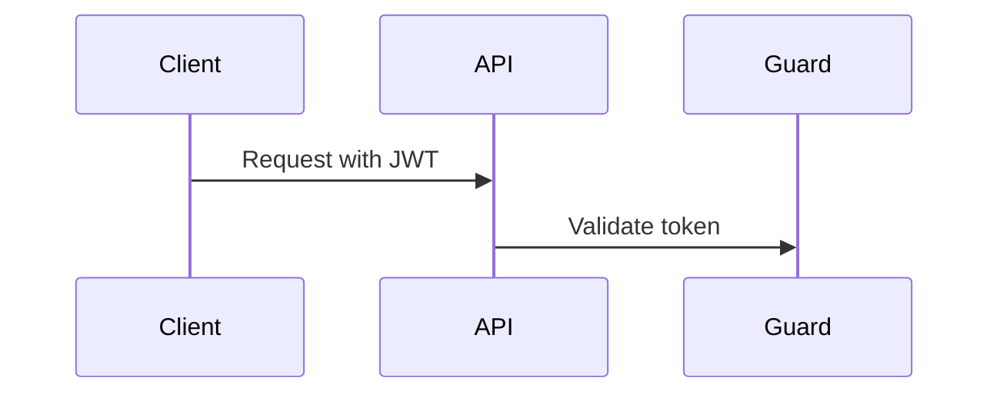

# Diagrams Guide

Use diagrams when they clarify architecture or flows better than text. Prefer Mermaid in Markdown so diagrams remain diffable and reviewable.

## Good Diagram Targets

- High-level NestJS module architecture.
- Request flow: client -> controller -> guard -> service -> Prisma -> PostgreSQL.
- JWT and Google Sign-In flow.
- Friendship request/accept/decline lifecycle.
- Real-time location flow with Socket.IO rooms and visibility checks.
- Data model relationships between users, friendships, and locations.
- Deployment/runtime boundaries when represented in code/config.

## Where To Put Diagrams

- `README.md`: only one small overview diagram if it helps onboarding.
- `docs/architecture.md`: module and request-flow diagrams.
- `docs/websocket-locations.md`: real-time event sequence diagrams.
- `docs/database.md`: data relationship diagrams.
- `docs/security.md`: auth/privacy flow diagrams.
- `docs/diagrams.md`: central diagram collection if diagrams span several concerns.

## Mermaid Rules

- Use fenced Mermaid blocks:

```markdown

```

- Keep node names short and domain-specific.
- Do not include secrets, real tokens, real user data, or exact coordinates.
- Keep diagrams synchronized with real code paths.
- Prefer one focused diagram over one large diagram that mixes unrelated concerns.

## Update Diagrams When

- Module boundaries change.
- Auth or ownership flow changes.
- Socket.IO event names, rooms, or visibility rules change.
- Prisma relationships or important lifecycle behavior changes.
- README or architecture text would otherwise become hard to follow.

## Avoid

- Decorative diagrams that do not explain behavior.
- Diagrams of future architecture not implemented in code.
- Large diagrams that need frequent churn for small implementation details.
